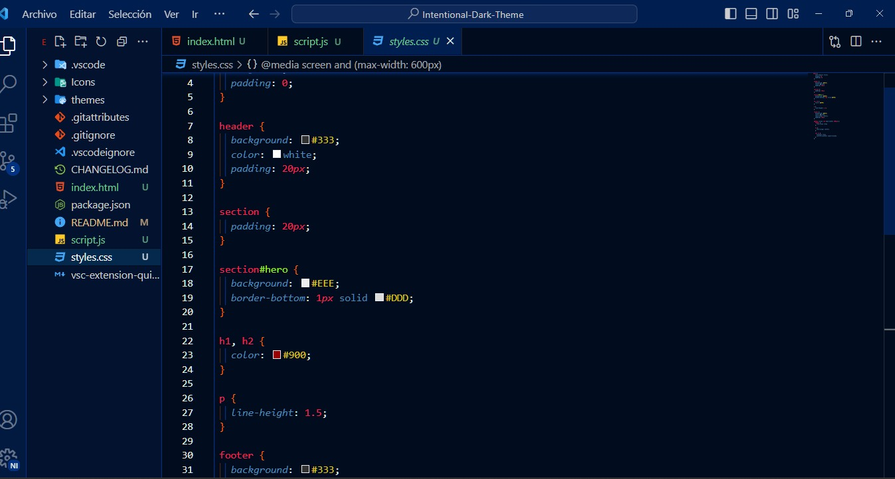
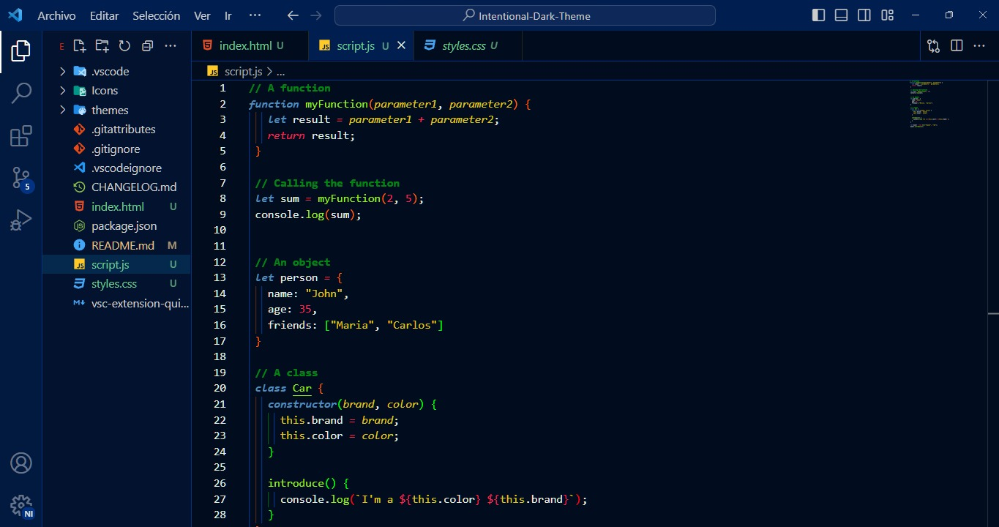

<p align="center">
   
   <h2 align="center" style="letter-spacing:1px;font-weight:900">Intentional Dark Theme</h2>
</p>

<p align="center" style="font-size:1.2rem">A very soft navy color theme.</p>

<p  align="center">
   
   
</p>


## Install

1. Open the **Extensions** sidebar in VS Code.
2. Search for `Navy Intentional Theme`. Choose the one by **Intentional-Co.**
3. Click the **Install** button
4. Go to Preferences ‣ Color Theme ‣ **Navy Intentional Theme**
5. I suggest you use the following code into your **settings.json**, this will help to get a vibrant color into the theme 👇

```json


      {
         "workbench.statusBar.visible": false,
         "workbench.colorTheme": "Intentional-Theme",
         "explorer.confirmDelete": false,
         "workbench.colorCustomizations": {
            "editorBracketHighlight.foreground1": "#FF6600",
            "editorBracketHighlight.foreground2": "#00ff00",
            "editorBracketHighlight.foreground3": "#ff0000",
            "editorBracketHighlight.foreground4": "#5a01ff",
            "editorBracketHighlight.foreground5": "#ffe100",
            "editorBracketHighlight.foreground6": "#000dff",
            "editorBracketHighlight.unexpectedBracket.foreground": "#db6165",
            "editorBracketMatch.background": "#ffffff34",
            "editorBracketMatch.border": "#ffffff2e",
         },

         "editor.tokenColorCustomizations": {
            "comments": "#07fc0380",      
         },
         "editor.guides.bracketPairs": true,
         "editor.autoClosingBrackets": "always",
         "git.confirmSync": false,
         "editor.fontSize": 13,
         "editor.tabSize": 3,
         "git.enableSmartCommit": true,
         "window.zoomLevel": 1,
         "terminal.integrated.env.windows": {},
         "liveServer.settings.donotShowInfoMsg": true,
         "console-ninja.featureSet": "Community",
         "explorer.confirmDragAndDrop": false,
         "workbench.iconTheme": "material-icon-theme"
      }
```


Don't forget to leave a review on the marketplace! **Enjoy!**